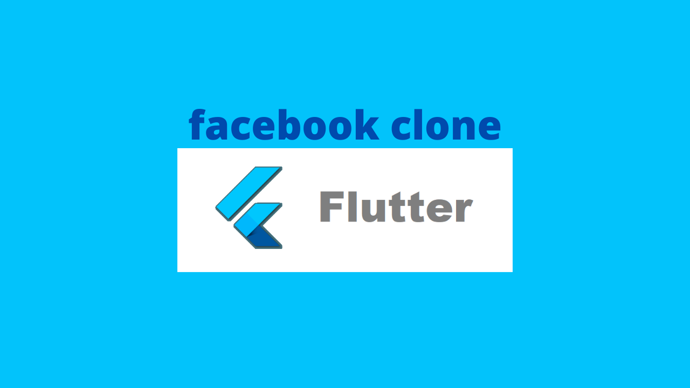
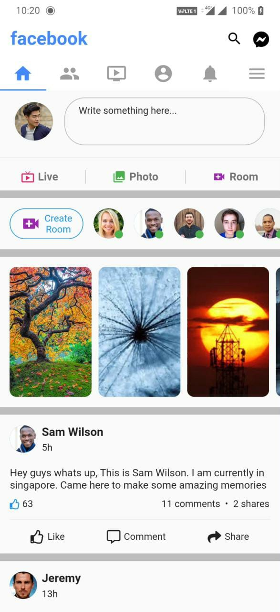
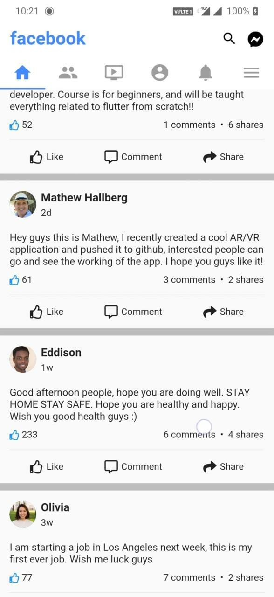
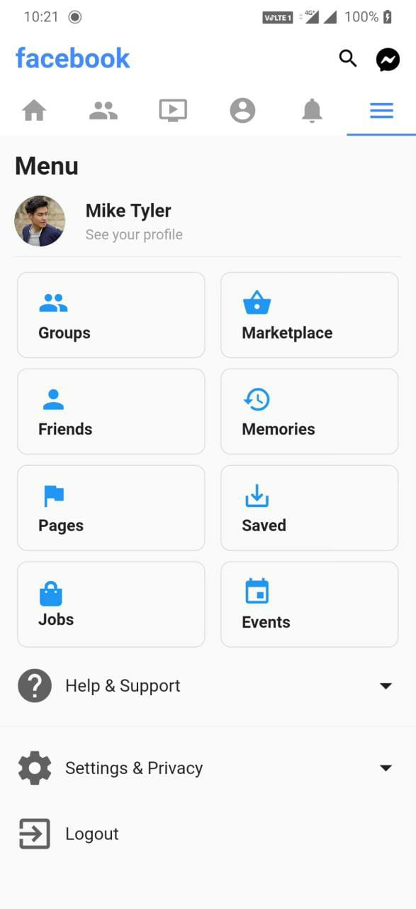

# facebook_ui_flutter   
   [](https://github.com/ahmedgulabkhan/facebook_ui_flutter)

**Star ⭐ this repo if you like what you see.**

<p></p>
<p style="text-align: center;"><b>facebook clone</b><p>

## About
A UI clone of the Facebook app that i created using Flutter.

## Snapshots

| Home Page | Home Page |
|------|-------|
|||

| Friends Page | Watch Page |
|------|-------|
|||

| Profile Page | Notifications Page |
|------|-------|
|||

| Menu Page |
|------|
|

## Configuration Steps
1. Cloning the repository:

```
$ git clone https://github.com/ahmedgulabkhan/facebook_ui_flutter.git
```

2. Open the project:

`$ cd facebook_ui_flutter`

3. Install the dependencies related to the project

`flutter pub get`

4. Now run the app on your connected device (using terminal):

`$ flutter run`

## Author(s)

[Ahmed Gulab Khan](https://www.github.com/ahmedgulabkhan)

## Other Flutter Projects

- [GroupChatApp](https://www.github.com/ahmedgulabkhan/GroupChatApp)  
- [Foodspace](https://www.github.com/ahmedgulabkhan/Foodspace)  
- [Atlas](https://www.github.com/ahmedgulabkhan/Atlas)  
- [GitTrends](https://www.github.com/ahmedgulabkhan/GitTrends)  
- [youtube_clone_flutter](https://www.github.com/ahmedgulabkhan/youtube_clone_flutter)  
- [SnakeGameFlutter](https://www.github.com/ahmedgulabkhan/SnakeGameFlutter)  

## LICENSE
```
MIT License

Copyright (c) 2020 Ahmed Gulab Khan

Permission is hereby granted, free of charge, to any person obtaining a copy
of this software and associated documentation files (the "Software"), to deal
in the Software without restriction, including without limitation the rights
to use, copy, modify, merge, publish, distribute, sublicense, and/or sell
copies of the Software, and to permit persons to whom the Software is
furnished to do so, subject to the following conditions:

The above copyright notice and this permission notice shall be included in all
copies or substantial portions of the Software.

THE SOFTWARE IS PROVIDED "AS IS", WITHOUT WARRANTY OF ANY KIND, EXPRESS OR
IMPLIED, INCLUDING BUT NOT LIMITED TO THE WARRANTIES OF MERCHANTABILITY,
FITNESS FOR A PARTICULAR PURPOSE AND NONINFRINGEMENT. IN NO EVENT SHALL THE
AUTHORS OR COPYRIGHT HOLDERS BE LIABLE FOR ANY CLAIM, DAMAGES OR OTHER
LIABILITY, WHETHER IN AN ACTION OF CONTRACT, TORT OR OTHERWISE, ARISING FROM,
OUT OF OR IN CONNECTION WITH THE SOFTWARE OR THE USE OR OTHER DEALINGS IN THE
SOFTWARE.
```